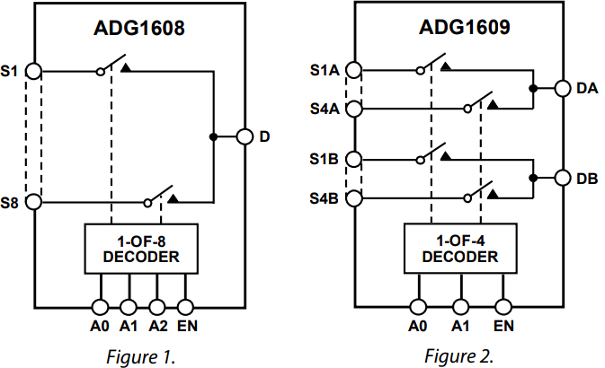
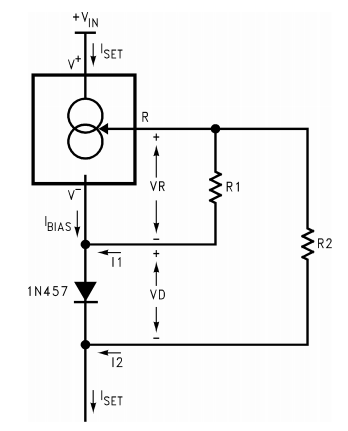
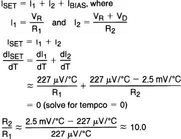

# Arias Research Group - PPG & Impedence Measurement

## Seiya Ono Sp'19

The goal of this project is to collaborate with doctors at UCSD and Dr. Muller's student, Sina Faraji, to create a test bench for our group's Bioimpedence Array and OLED/OPD Oxymeter sensors to measure tissue damage in mice. We hope to use Sina Faraji's new OLED/OPD driver chip to take PPG measurements while using our own impedence arrays and electronics to measure tissue impedence and driver current through our target.

-----

## Specs

- 1 PPG Sensor
    - 1 Red OLED
    - 1 NIR OLED
    - 1 OPD
    - Sina's Driver Chip
- 15 Impedence Electrodes
    - Impedence measurement AFE
    - Current Driver (200uA to 700uA, up to 1mA)
    - 15 to 2 selection mux
- 9V Power
- Coms over Serial

### PPG Sensor

Sina's OLED/OPD Driver Amplifier has the capability to driver 8 pairs of OLEDs and take readings from 8 OPDs. It handles all the amplification through SPI programmable registers. The closed loop in the transimpedence amplifiers can help get rid of any DC components in the OPD readings. It runs off of 1.1V digital logic, and 8V driver power.

If his chip does not go well, we will implement our own OLED drivers and OPD transimpedence amplifiers.

### Impedence Electrodes

We were asked to get our 15 electrode array to be able to take any impedence measurement between any two user selectable electrodes, while also being able to select any two electrodes to drive with a set amount of current. This divides this part of the board into three distance parts - the multiplexor selection and configuration, tunable current source, and impdence measurement. The following section will outline the different chip selection and their respective specs.

#### Multiplexor

Because the board is spec'd to be able to take impedence measurements as well as source current, it is critical to choose a multiplexor that has very low on resistance, while having very high off resistance. Luckily, most CMOS technology has this as standard, so picking an analog mux was not very difficult. We settled with the [ADG1608/1609](https://www.analog.com/en/products/adg1608.html) because of its 3 bit (8 input) mux, as well as its secondary variant 2 bit (4x2 input) DPDT (double pole double throw) configuration. To differentiate, the ADG1608 variant is the 3 bit 8 input mux, and the ADG1609 is the 2 bit 4x2 input mux. See the figure below for clarification.

By using two pairs of ADG1608's, a 16x2 input 1x2 output can be created. This means the circuit can individually select a pair of electrodes to be used by the impedence analyzer and tunable current source. To select between either of the two inputs, the ADG1609 will be used as a demuxer to select either the impedence analyzer or tunable current source. The DPDT configuration is very usedful in this sceneario because we are trying to always drive a _pair_ of electrodes. Here are some important specs when running off of a 3.3V power rail.

| Parameter | Value | Unit |
| --------- | ----- | ---- |
| R\_on      | 13.5  | Ohms |
| S/D Leakage | 0.1 | nA max |
| -3dB 1608 | 34 | MHz typ |
| -3dB 1609 | 72 | MHz typ |
| C\_S OFF | 23 | pF typ |
| C\_D OFF 1608 | 145 | pF type |
| C\_D OFF 1609 | 72 | pF typ |
| C\_S/D ON 1608 | 173 | pF typ |
| C\_S/D ON 1609 | 95 | pF typ |
| I\_DD | 0.001 | uA typ |
| V\_DD | 3.3 | V |
|I\_S/D 1608 | 126 | mA max |
|I\_S/D 1609 | 94 | mA max |

As we are dealing with specimens in the 10K Ohm range, the 13.5 Ohm and 173pF ON impedence is negligible, even if the electrode is traveling through 2 multiplexors. The max available current draw is much over the required 1mA of current through the electrodes, so the chip fits our needs. It aslo fits our impedance chip bandwidth, where it can do frequency sweeps over 1kHz to 100kHz. More on this in the "Impedence Analyzer" section.

#### Tunable Current Source

In order to drive our selectable electrodes with a user defined amount of current, we needed an adjustable current source. For this task, the [LM134/LM234/LM334 3-Terminal Adjustable Current Source](http://www.ti.com/product/LM134) was chosen. Specifically, the LM334 was chosen for its small form factor and easily identifiable 3-Pin Through Hole casing. It has a huge operating voltage from 1V to 40V, and can be tuned to supply current between 1uA to 10mA. The chip can also be operated in a temperature compensation region to eliminate its temperature dependence up to 0.2% accuracy.

For this circuit, the diode to use was already suggested, so the next choice was to pick out a digital potentiometer. TI also provided the math to prove the temperature coefficient compensation with the chosen diode, and drew the following relationship between R1 and R2:

From this, 1k and 10k 256 step digital potentiometers were chosen, with the math coming out to 3.9/39 Ohms per step, capable of driving in the range of 67.7uA to just short of 1mA. This just about fits our spec, going over to the upper limit of 1mA. The digital potentiometers chosen are the [AD8400](https://www.analog.com/en/products/ad8400.html) in both the 1K and 10K variant. They are controlled over SPI as designated write only slave devices. It can operate at between 3V and 5.5V and will typically draw less than 1mA.

#### Impedence Measurements

We would like to measure impedences between 1M Ohm (Magnitude) and 1k Ohm on our species. The chip for this is the [AD5933](https://www.analog.com/en/products/ad5933.html) which can do frequency sweeps. See Page 14 of the Data Sheet for more information on how to program the chip to do this.

Setting Gain - See Page 18 on how to choose the Gain setting resistor R\_FB to ensure that the analog readings do not saturate. The gain factor needs to be recalculated if R\_FB changes, if the output excitation voltage (more on this later) changes, or if the PGA gain is set differently. On the topic of operating voltages, there are 4 to choose from:

| Range | Output Excitation Voltage Amplitude | Output DC Bias Level |
| ----- | ----------------------------------- | -------------------- |
| 1 | 1.98 V p-p | 1.48 V |
| 2 | 0.97 V p-p | 0.76 V |
| 3 | 383 mV p-p | 0.31 V |
| 4 | 198 mV p-p | 0.173 V|

These numbers factor into what value should be chosen for the feedback resistor.

The chip does come with an internal 16.776 MHz oscillator, but it can be replaced by placing a 16MHz oscillator on MCLK, and then setting the control register to use the external clock. By default, on power up the internal oscillator is selected.
